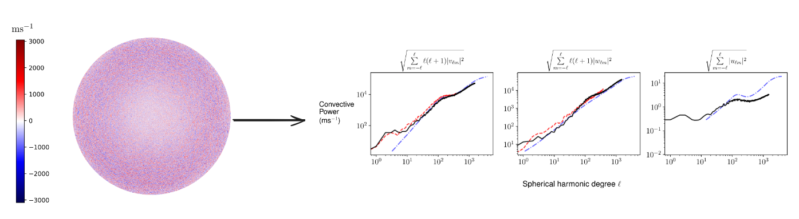

# DopplerVel: Solar Velocity Field Analysis Toolkit

[](https://arxiv.org/abs/2105.12055)
[](https://doi.org/10.3847/1538-4357/ac05bc)
[-green)](https://iopscience.iop.org/article/10.3847/1538-4357/ac05bc)
[](https://www.python.org/downloads/)
[](https://opensource.org/licenses/MIT)



A comprehensive Python toolkit for processing HMI Dopplergrams and LCT velocity data to analyze solar surface convective flows through spherical harmonic decomposition.

## Overview

**DopplerVel** processes solar velocity observations to decompose surface flows into radial, poloidal, and toroidal components using vector spherical harmonics. The toolkit handles the complete pipeline from raw HMI observations to power spectra, accounting for observational effects through a careful inversion procedure.

### Key Features

- **Multi-Modal Data Support**: Process both Doppler velocity and Local Correlation Tracking (LCT) data
- **Complete Pipeline**: From raw FITS files to spherical harmonic coefficients
- **Leakage Matrix Inversion**: Correct for line-of-sight projection effects
- **HEALPix Integration**: Efficient spherical harmonic transforms using healpy
- **Time Series Analysis**: Extract temporal power spectra and frequency characteristics
- **Multiple Regularization Methods**: SVD, Tikhonov, and custom regularization schemes
- **Diagnostic Plotting**: Comprehensive visualization tools for quality assessment

## Physics Background

Solar convection manifests as flows on the Sun's surface that can be decomposed into three fundamental components:

- **Radial flows** ($u$): Vertical motion perpendicular to the surface
- **Poloidal flows** ($v$): Meridional circulation patterns  
- **Toroidal flows** ($w$): Azimuthal/zonal flows

These are related to observations through vector spherical harmonics:

$$\mathbf{v}(\theta, \phi) = \sum_{\ell m} \left[ u_{\ell m} Y_{\ell m} \hat{r} + v_{\ell m} \mathbf{Y}_{\ell m}^{(1)} + w_{\ell m} \mathbf{T}_{\ell m}^{(1)} \right]$$

Line-of-sight observations introduce coupling between components (leakage), which this package corrects through matrix inversion.

## Installation

### Requirements

- Python 3.7+
- NumPy
- SciPy
- Matplotlib
- healpy
- astropy
- sunpy
- pyshtools

### Quick Install

```bash
git clone https://github.com/samarth-kashyap/dopplervel.git
cd dopplervel
pip install -r requirements.txt
```

### Development Install

```bash
git clone https://github.com/samarth-kashyap/dopplervel.git
cd dopplervel
pip install -e .
```

## Usage

### Automated Pipeline

For convenience, the complete 6-step pipeline can be run automatically using the provided script:

```bash
./run_pipeline.sh [year] [start_day] [end_day] [ncores] [lmin] [lmax]
```

**Parameters:**
- `year`: Observation year (default: 2018)
- `start_day`: Starting day number (default: 0)
- `end_day`: Ending day number (default: 365)
- `ncores`: Number of parallel cores (default: 48)
- `lmin`: Minimum spherical harmonic degree (default: 0)
- `lmax`: Maximum spherical harmonic degree (default: 1535)

**Examples:**
```bash
# Run full pipeline with defaults
./run_pipeline.sh

# Process year 2019, days 100-200, with 32 cores, l=0-1000
./run_pipeline.sh 2019 100 200 32 0 1000

# Test run with small range
./run_pipeline.sh 2018 0 10 4 0 100
```

The script runs all 6 steps sequentially: preprocessing → spherical harmonics → matrix generation → inversion → coordinate rotation → time series analysis.

### Manual Step-by-Step Processing

Alternatively, you can run each step individually:

### 1. Data Preprocessing

Process raw HMI Dopplergrams by removing systematic effects:

```bash
python hathaway.py --gnup <day_number>
```

This removes:
- Satellite velocity (observer motion)
- Gravitational redshift (632 m/s)
- Large-scale differential rotation and meridional circulation
- Limb shift effects

### 2. Spherical Harmonic Transform

Convert processed images to spherical harmonic coefficients:

```bash
python data_analysis.py --gnup <day_number>
```

Creates HEALPix maps and computes vector spherical harmonic coefficients ($u_{\ell m}$, $v_{\ell m}$, $w_{\ell m}$).

### 3. Generate Leakage Matrices

Compute the observation matrices that encode line-of-sight projection:

```bash
python generate_matrix.py --gnup <azimuthal_order>
```

For parallel processing across azimuthal orders $m$:

```bash
seq 0 1535 | parallel -j 48 python generate_matrix.py --gnup {}
```

### 4. Inversion

Correct for observational leakage to recover true velocity components:

```bash
python inversion.py --gnup <azimuthal_order>
```

Supports multiple regularization methods:
- `inv_reg1supp`: Tikhonov with component-specific weights
- `inv_reg2`: Second-order difference regularization
- `inv_reg3`: Third-order difference regularization
- `inv_SVD`: Singular value decomposition with threshold

### 5. Coordinate Transformation

Rotate velocity fields from disk-center to solar-north coordinates:

```bash
python rotation.py --gnup <day_number>
```

### 6. Time Series Analysis

Analyze temporal evolution and extract frequency spectra:

```bash
python time_series.py --datatype doppler
```

## Project Structure

```
dopplervel/
├── README.md                      # This file
├── run_pipeline.sh               # Automated pipeline script
├── requirements.txt               # Python dependencies
│
├── globalvars.py                  # Configuration and global parameters
├── conventions.py                 # Spherical harmonic conventions
│
├── hathaway.py                    # Data preprocessing pipeline
├── data_analysis.py              # SHT and map creation
├── generate_matrix.py            # Leakage matrix generation
├── inversion.py                  # Inversion algorithms
├── rotation.py                   # Coordinate transformations
├── time_series.py                # Temporal analysis
│
├── compute_regparam.py           # L-curve analysis for regularization
├── get_synthetic_spectra.py      # Synthetic test data generation
├── lct_process.py                # LCT data processing
│
├── interpolation/                # Grid interpolation utilities
│   ├── interpolation.py
│   └── timeseries.py
│
├── magnetogram/                  # Vector magnetogram processing
│   ├── vec_magneto.py
│   └── ...
│
├── plots/                        # Visualization and plotting
│   ├── vecdoppler_ts.py
│   └── ...
│
└── jobscripts/                   # HPC job submission scripts
    └── ...
```

## Data Requirements

### HMI Dopplergrams

- **Series**: `hmi.V_720s` (720-second cadence)
- **Source**: [JSOC](http://jsoc.stanford.edu/)
- **Format**: FITS files with velocity in m/s
- **Coordinate System**: Heliographic Stonyhurst

### LCT Velocity Data

- **Components**: Latitudinal and longitudinal velocities
- **Format**: FITS or NPY arrays
- **Grid**: Uniform latitude-longitude grid

## Configuration

Edit `globalvars.py` to configure:

```python
class DopplerVars():
    def __init__(self, day):
        self.scratch = "/scratch/g.samarth"      # Working directory
        self.nside = 512                          # HEALPix resolution
        self.year = "2018"                        # Observation year
        self.day = day                            # Day number
```

Key parameters:
- `nside`: HEALPix NSIDE parameter (affects resolution: $\ell_{\rm max} = 3 \times {\rm NSIDE} - 1$)
- Resolution: NSIDE=512 → $\ell_{\rm max}$=1535
- Higher NSIDE = better resolution but more computational cost

## Computational Requirements

### Memory

- ~16 GB RAM for NSIDE=512
- ~64 GB RAM for NSIDE=1024

### Storage

- ~50 GB per year of HMI data (processed)
- ~200 GB for leakage matrices ($\ell_{\rm max}$=1535)

### Processing Time

On typical HPC nodes (48 cores):
- Data preprocessing: ~2 hours per year
- Matrix generation: ~6 hours (parallel)
- Inversion: ~4 hours per year (parallel)

## Scientific Applications

This toolkit has been used to study:

- ✅ Solar convective power spectra at different scales
- ✅ Comparing Doppler and LCT velocity measurements
- ✅ Temporal evolution of convective flows
- ✅ Separation of convection from large-scale flows

## Citation

If you use this code in your research, please cite:

```bibtex
@article{Kashyap2021,
  title={Characterising solar surface convection using Doppler measurements},
  author={Kashyap, Samarth G. and Hanasoge, Shravan M.},
  journal={The Astrophysical Journal},
  volume={916},
  number={2},
  pages={87},
  year={2021},
  publisher={IOP Publishing},
  doi={10.3847/1538-4357/ac05bc},
  url={https://doi.org/10.3847/1538-4357/ac05bc}
}
```

**ADS**: [2021ApJ...916...87K](https://ui.adsabs.harvard.edu/abs/2021ApJ...916...87K)  
**arXiv**: [2105.12055](https://arxiv.org/abs/2105.12055)

## References

## References

- **Kashyap & Hanasoge (2021)**: "Characterising solar surface convection using Doppler measurements", ApJ 916, 87 ([doi:10.3847/1538-4357/ac05bc](https://doi.org/10.3847/1538-4357/ac05bc))
- **Hathaway et al. (2015)**: "The Sun's Photospheric Convection Spectrum", ApJ 811, 105 ([doi:10.1088/0004-637X/811/2/105](https://doi.org/10.1088/0004-637X/811/2/105), [arXiv:1508.03022](https://arxiv.org/abs/1508.03022))
- Hanasoge, S. M., et al. (2012): "Anomalously weak solar convection"
- HEALPix: [healpy documentation](https://healpy.readthedocs.io/)
- SunPy: [sunpy.org](https://sunpy.org/)

## Contributing

Contributions are welcome! Please:

1. Fork the repository
2. Create a feature branch (`git checkout -b feature/improvement`)
3. Commit your changes (`git commit -am 'Add new feature'`)
4. Push to the branch (`git push origin feature/improvement`)
5. Open a Pull Request

## Issues and Support

- **Bug reports**: [GitHub Issues](https://github.com/samarth-kashyap/dopplervel/issues)
- **Questions**: Open a discussion or contact the authors

## License

This project is licensed under the MIT License - see the [LICENSE](LICENSE) file for details.

## Authors

- **Samarth G. Kashyap** - *Primary developer* - Tata Institute of Fundamental Research

## Acknowledgments

- SDO/HMI team for providing high-quality data
- HEALPix and healpy developers
- The solar physics community for valuable discussions

---

